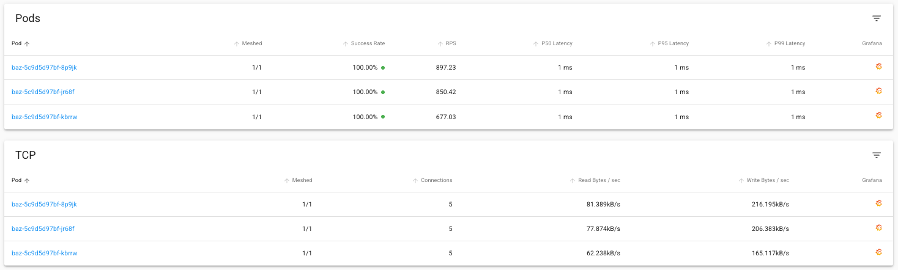
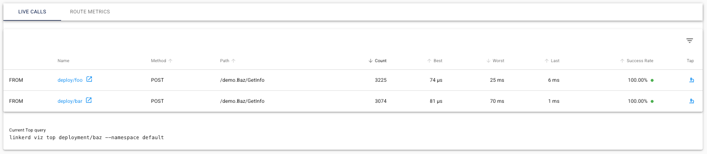
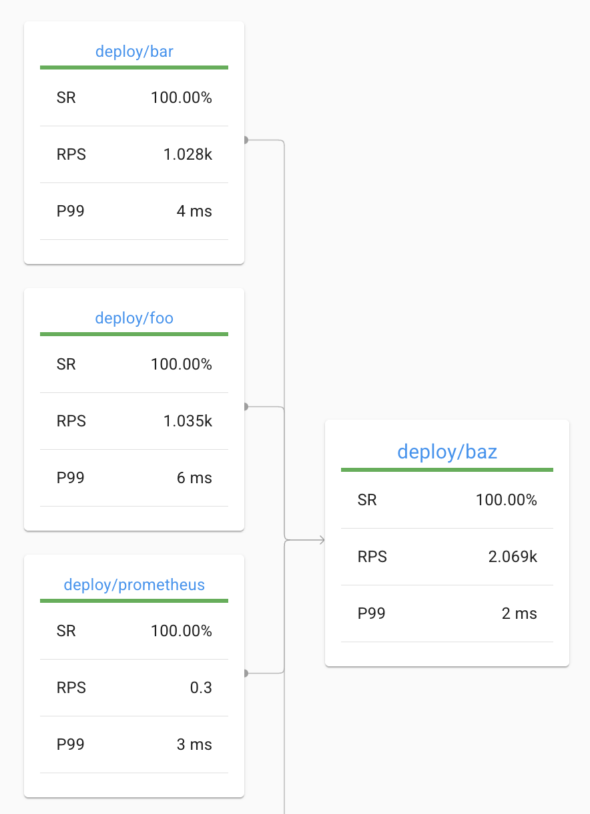

# Building a Linkerd Demo: Adding gRPC Support (Part 2)

In [Part 1](part_1.md) of this series, we set up a simple microservices demo with Linkerd on a local Kubernetes cluster using Tilt. We created three services (foo, bar, and baz) that communicate via HTTP REST. Now, we're going to extend our demo to support gRPC communication between services and explore Linkerd's gRPC-specific features.

## Architecture Overview

Let's review our demo application architecture:

1. **foo** - An entry point service that makes parallel requests to bar and baz
2. **bar** - A middle-tier service that processes requests and calls baz
3. **baz** - A backend service that returns request information

These services are all written in Go and deployed to a local Kubernetes cluster. We're using Tilt for a fast inner development loop, which allows us to see our changes in real-time as we modify the code.

Our architecture currently looks like this:

```
┌─────────┐     ┌─────────┐     ┌─────────┐
│         │     │         │     │         │
│  nginx  │────►│   foo   │────►│   bar   │
│         │     │         │     │         │
└─────────┘     └────┬────┘     └────┬────┘
                     │               │
                     │               │
                     │               ▼
                     │          ┌─────────┐
                     │          │         │
                     └─────────►│   baz   │
                                │         │
                                └─────────┘
```

_Note: when running locally there is also a `synthetic` service that is constantly driving high traffic through the `foo` service to simulate application load._

## The gRPC Implementation

Since the initial blog post, we've enhanced our application to support both HTTP REST and gRPC communication. Key components of our implementation include:

### 1. Protocol Buffer Definitions

We created a shared Protobuf schema that defines our service interfaces:

```protobuf
// services.proto
syntax = "proto3";

package demo;
option go_package = "./proto";

service Foo {
  rpc GetInfo (InfoRequest) returns (InfoResponse);
}

service Bar {
  rpc GetInfo (InfoRequest) returns (InfoResponse);
}

service Baz {
  rpc GetInfo (InfoRequest) returns (InfoResponse);
}

message InfoRequest {
  string client = 1;
  map<string, string> headers = 2;
}

message InfoResponse {
  string message = 1;
  string hostname = 2;
  map<string, string> headers = 3;
  int32 status = 4;
}
```

### 2. Dual Protocol Support

Each service now supports both HTTP REST and gRPC:

- Each service runs an HTTP server on port 8080
- Each service runs a gRPC server on port 9090
- A `USE_GRPC` environment variable controls which protocol is used for service-to-service communication
- Kubernetes configuration has been updated to support the dual protocol of our services

### 3. Tilt Configuration

We've enhanced our Tilt setup to make switching between protocols and service mesh options easy:

```sh
# Run with HTTP REST (default)
tilt up

# Run with gRPC (no Linkerd)
tilt up -- --use_grpc

# Run with HTTP REST and Linkerd
tilt up -- --use_linkerd

# Run with gRPC and Linkerd
tilt up -- --use_grpc --use_linkerd
```

These configuration flags allow us to test our application in different modes, which is especially useful for comparing performance and behavior across different configurations.

## Leveraging Linkerd with gRPC

A compelling demonstration of Linkerd's power is to observe the behavior when running gRPC without Linkerd (`tilt up -- --use_grpc`). You'll notice that the `foo` service only interacts with a single instance of the `baz` service. This occurs because gRPC requests don't load balance across services by default. For a detailed explanation of this behavior, see [gRPC Load Balancing on Kubernetes without Tears](https://linkerd.io/2018/11/14/grpc-load-balancing-on-kubernetes-without-tears/). To effectively utilize gRPC without sacrificing load balancing, we need to enable Linkerd by running the app with the additional `--use_linkerd` flag:

```sh
tilt up -- --use_grpc --use_linkerd
```

### A Virtual Tour

With our application running with both gRPC and Linkerd enabled, we can explore Linkerd's benefits.

The graphic below illustrates two key advantages. First, Linkerd automatically provides request and TCP metrics for our application without requiring any monitoring implementation on our part. Second, we can confirm proper load balancing across all baz pods. Without Linkerd, requests would be pinned to a single instance—a significant drawback when working with a small number of pods where statistical load distribution is less effective.



The next graphic shows live calls to our service. This visibility is particularly valuable because we can clearly see that the calls have transitioned to the gRPC endpoints `/demo.Baz/GetInfo`. Since our application supports dual protocols, this visual confirmation helps verify that we're properly configured in gRPC mode.



While the dashboard provides intuitive visualizations, the Linkerd CLI offers the same data in a terminal-friendly format for quick diagnostics:

```bash
$ linkerd viz top deployment/baz
Source                Destination           Method      Path                Count    Best   Worst    Last  Success Rate
foo-64798767b7-x8xvf  baz-659dbf6895-v7gdm  POST        /demo.Baz/GetInfo    1187    81µs     9ms   124µs       100.00%
bar-577c4bf849-cpdxl  baz-659dbf6895-9twg9  POST        /demo.Baz/GetInfo    1103    86µs     6ms   140µs       100.00%
foo-64798767b7-x8xvf  baz-659dbf6895-7chgx  POST        /demo.Baz/GetInfo    1084    79µs     9ms   355µs       100.00%
bar-577c4bf849-cpdxl  baz-659dbf6895-7chgx  POST        /demo.Baz/GetInfo    1061    93µs     7ms   293µs       100.00%
foo-64798767b7-x8xvf  baz-659dbf6895-9twg9  POST        /demo.Baz/GetInfo    1042    81µs     5ms   565µs       100.00%
bar-577c4bf849-cpdxl  baz-659dbf6895-v7gdm  POST        /demo.Baz/GetInfo     958    75µs     8ms   203µs       100.00%
```

### Implementing gRPC Authorization

Let's now implement an authorization policy for our new gRPC routes on the `baz` service. This policy provides fine-grained control over which services can access our endpoints. First, we need to create a new server and route definition. The server will represent the gRPC endpoint we've opened on the baz service. As with our HTTP route, we'll implement a default deny policy to ensure our services require explicit authorization.

```yaml
---
apiVersion: policy.linkerd.io/v1beta1
kind: Server
metadata:
  name: baz-grpc
  namespace: default
spec:
  podSelector:
    matchLabels:
      app: baz
  port: grpc # grpc port defined from our service
  proxyProtocol: gRPC
  accessPolicy: deny # deny all traffic by default
```

After applying this configuration, you'll immediately notice that communication between our components breaks:

```bash
rpc error: code = PermissionDenied desc = client 192.168.194.77:57364: server: 192.168.194.70:4143: unauthorized request on route
```

This error occurs due to two factors: our default `deny` accessPolicy and the lack of proper gRPC traffic labeling for Linkerd to identify and authorize requests.

To resolve this issue, we need to authorize our services to connect to the new server. We'll follow the same pattern we used for HTTP authorization: the `foo` service will receive server-level authorization, while the `bar` service will get route-level authorization. Let's start with implementing authorization for `foo`.

#### Foo

To enable server-level authorization for `foo > baz` communication, we first need to identify the gRPC routes on the baz service. This requires creating both inbound and outbound route definitions. For a detailed explanation of the differences between these route types, see the [official documentation](https://linkerd.io/2.17/reference/grpcroute/).

**Outbound**

```yaml
---
apiVersion: gateway.networking.k8s.io/v1alpha2
kind: GRPCRoute
metadata:
  name: baz-grpc-outbound
  namespace: default
spec:
  parentRefs:
    - name: baz-grpc
      kind: Server
      group: policy.linkerd.io
  rules:
    - backendRefs:
        - name: baz
          port: 9090
```

**Inbound**

```yaml
---
apiVersion: gateway.networking.k8s.io/v1alpha2
kind: GRPCRoute
metadata:
  name: baz-grpc-inbound
  namespace: default
spec:
  parentRefs:
    - name: baz-grpc
      kind: Server
      group: policy.linkerd.io
  rules:
    - backendRefs:
        - name: baz
          port: 9090
```

Next we can authorize the foo service to access our baz gRPC server.

```yaml
---
apiVersion: policy.linkerd.io/v1alpha1
kind: MeshTLSAuthentication
metadata:
  name: foo-baz-authn
  namespace: default
spec:
  identities:
    - "foo.default.serviceaccount.identity.linkerd.cluster.local"
---
apiVersion: policy.linkerd.io/v1alpha1
kind: AuthorizationPolicy
metadata:
  name: baz-grpc-authn
  namespace: default
spec:
  targetRef:
    group: policy.linkerd.io
    kind: Server
    name: baz-grpc
  requiredAuthenticationRefs:
    - name: foo-baz-authn
      kind: MeshTLSAuthentication
      group: policy.linkerd.io
```

_Note: the MeshTLSAuthentication can be shared between gRPC and HTTP routes_

With these definitions in place, we've successfully established an authorized connection from `foo > baz`.

#### Bar

Since we've already configured the routes for our service, implementing route-level authorization for `bar` is straightforward.

```yaml
---
apiVersion: policy.linkerd.io/v1alpha1
kind: MeshTLSAuthentication
metadata:
  name: baz-bar-authn
  namespace: default
spec:
  identities:
    - "bar.default.serviceaccount.identity.linkerd.cluster.local"
---
apiVersion: policy.linkerd.io/v1alpha1
kind: AuthorizationPolicy
metadata:
  name: baz-grpc-route-authn
  namespace: default
spec:
  targetRef:
    group: gateway.networking.k8s.io
    kind: GRPCRoute
    name: baz-grpc-inbound
  requiredAuthenticationRefs:
    - name: baz-bar-authn
      kind: MeshTLSAuthentication
      group: policy.linkerd.io
```

And that's it! We've efficiently re-used our inbound route configuration to authorize the bar service to access our baz endpoints.

With both authorization policies in place, our services can now communicate securely via gRPC:



## Conclusions

In this tutorial, we've enhanced our demo application with gRPC support while leveraging Linkerd's powerful capabilities to simplify the integration process. We've seen how Linkerd solves critical challenges with gRPC in Kubernetes, particularly around load balancing and monitoring. By implementing Linkerd's authorization policies, we've also secured our services against unauthorized connections, demonstrating how service mesh technology can both improve functionality and strengthen security in modern microservice architectures.

The combination of gRPC and Linkerd provides a solid foundation for building high-performance, secure, and observable microservices. This approach allows teams to benefit from gRPC's efficiency while addressing its operational challenges through Linkerd's service mesh capabilities.
